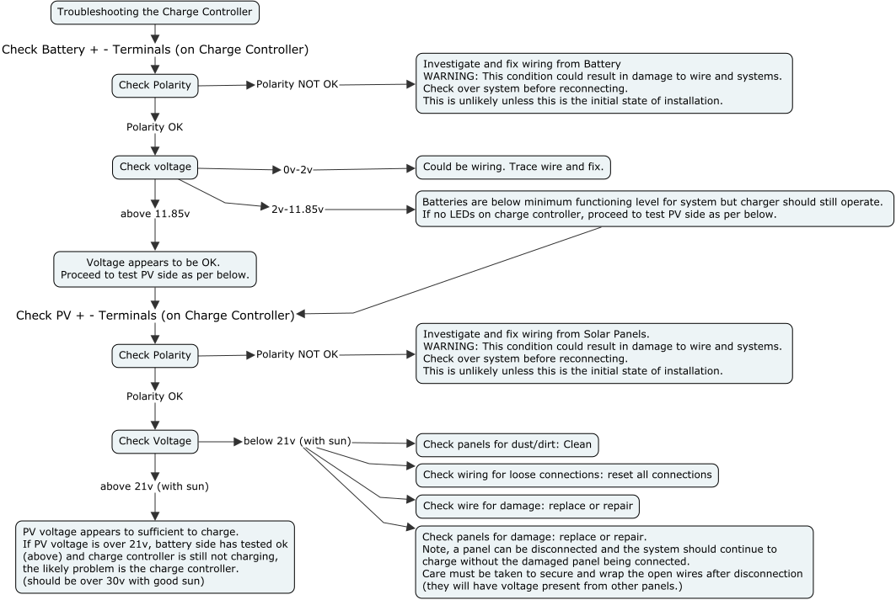

Charge Controller NOT charging
===========================================================================

## Symptoms are there IS sun and NO led lights blue on Charge Controller.

Before you start, double check all breakers to make sure NONE are tripping. If one is tripping, there is a system fault that needs to be addressed. Turn OFF the system breaker before proceeding with the following workflow.

##  1. Check Battery Terminals (on charge controller)
--------------------

* Check polarity
  - Polarity WRONG: Investigate and fix wiring from Battery to Charge Controller. WARNING: This condition could result in damage to wire and systems. Check over system before reconnecting. This is unlikely unless this is the initial state of installation.
  - Polarity OK: Check Voltage
    - Under 11.85v
      - NO Voltage - 2v: Could be wiring. Trace wire and fix.
      - 2v-11.85v: Batteries are below minimum functioning level for system but charger should still operate. If no LEDs on charge controller, proceed to test PV side as per below. 
    - Over 11.85v: Voltage appears to be OK. Proceed to test PV side as per below.

## 2. Check PV Terminals (on charge controller)
---------------

* Check polarity
  - Polarity WRONG: Investigate and fix wiring from Solar Panels. WARNING: This condition could result in damage to wire and systems. Check over system before reconnecting. This is unlikely unless this is the initial state of installation.
  - Polarity OK: Check PV Voltage
    - Voltage is below 21v (during sun)
      - Check panels for dust: clean
      - Check wiring for loose connections: reset all connections
      - Check wire for damage: replace or repair
      - Check panels for damage: replace or repair. Note, a panel can be disconnected and the system should continue to charge without the damaged panel being connected. Care must be taken to secure and wrap the open wires after disconnection (they will have voltage present from other panels.)
    - Voltage is over 21v (should be ~30v). PV voltage appears to be OK. If PV voltage is over 21v, battery side is ok (above) and charge controller is not charging, The likely problem is the charge controller.

